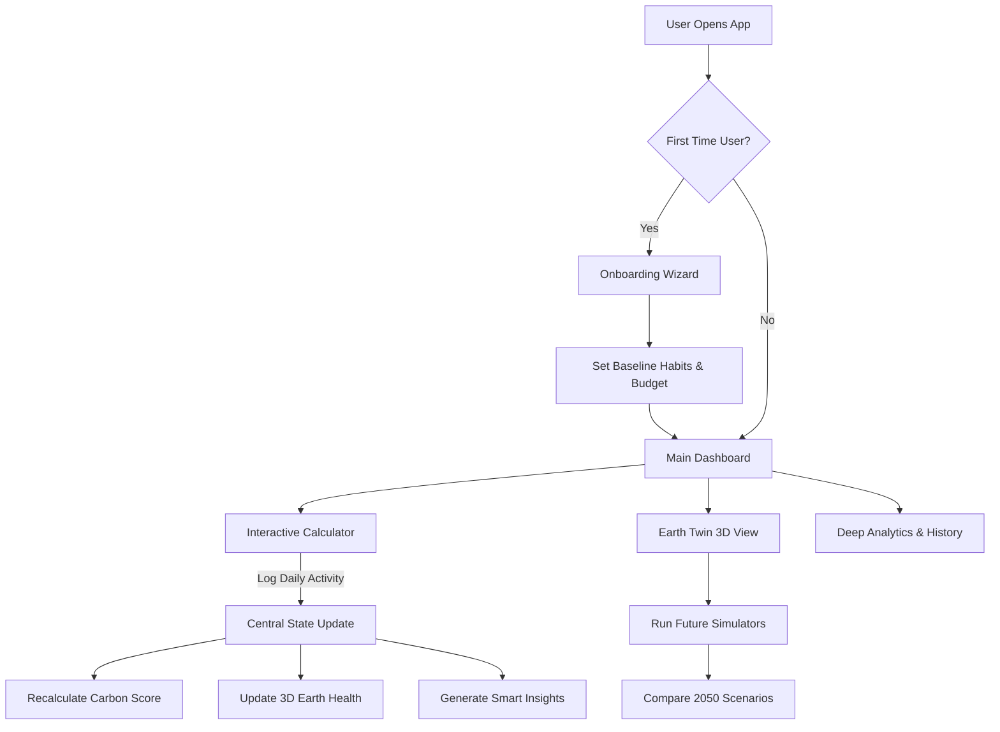

# CarbonTrackr

**Canopy: Personal Environmental Operating System**

CarbonTrackr is a premium, data-driven web application designed to help individuals calculate, track, and visualize their daily carbon footprint and environmental impact.

## Features

- **Interactive Carbon Calculator:** Quickly log daily habits across transportation, food, household energy, shopping, waste, and water.
- **Earth Twin Visualization:** A live, dynamic 3D rendering of the Earth that reflects your personal carbon footprint's health. 
- **Deep Analytics:** Track daily, weekly, and monthly emissions with detailed breakdown charts and heatmaps.
- **Future Simulators:** Adjust theoretical lifestyle changes to see how your carbon footprint and Earth's health would respond in 1 to 5 years.
- **Smart Insights:** Data-derived suggestions to minimize impact based on the categories where you emit the most.
- **Responsive Premium UI:** Glassmorphic layout, micro-interactions, dark mode aesthetics, and fluid animations.

## Application Flow & Architecture



## Technologies Used

- **Frontend:** HTML5, Vanilla JavaScript (ES6), CSS3
- **Build Tool:** Vite (for module bundling and local dev server)
- **UI Architecture:** Custom CSS variables, Grid/Flexbox layouts, HTML Canvas (for Earth 3D visualizer)

## Project Structure

```text
/
├── .env                # Environment variables (excluded from git)
├── .gitignore          # Files excluded from source control
├── index.html          # Main application entry point
├── package.json        # NPM scripts and dependencies
├── src/
│   ├── css/
│   │   └── styles.css  # Premium design system and layout styling
│   └── js/
│       └── app.js      # Core application logic, canvas drawing, and state
```

## Setup & Installation

To run the application locally, you'll need [Node.js](https://nodejs.org/) installed on your machine.

1. **Clone the repository:**
   ```bash
   git clone https://github.com/your-username/carbontrackr.git
   cd carbontrackr
   ```

2. **Install dependencies:**
   ```bash
   npm install
   ```

3. **Set up Environment Variables:**
   - Review the `.env` file for any required configuration keys. Note that `.env` is intentionally ignored by git to keep your secrets secure.

4. **Start the Development Server:**
   ```bash
   npm run dev
   ```
   *Open the URL provided in your terminal (usually http://localhost:5173) to view the app.*

## Building for Production

To create an optimized production build:

```bash
npm run build
```

This will generate a `dist/` directory containing minified and bundled files ready to be deployed to any static hosting provider (e.g., Vercel, Netlify, GitHub Pages).

## Contribution

If you want to contribute, please fork the repository and create a pull request with your changes. Keep PRs focused on single feature additions or bug fixes.
